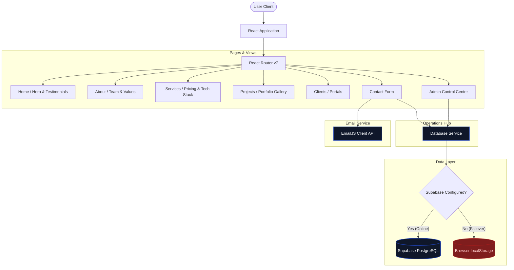

# 🌐 S'K One Tech Support Portal

[](https://react.dev/)
[](https://vite.dev/)
[](https://tailwindcss.com/)
[](https://supabase.com/)
[](https://vercel.com/)

A premium, interactive business portal for **S'K One Tech Support**. Engineered with a focus on modern product design and robust architecture, this application delivers a high-performance web experience for client inquiries, interactive IT operations management, and secure feedback gathering. 

---

## 🎯 Product Vision

Our goal was to build more than just a landing page. We envisioned a comprehensive **client portal** that bridges the gap between our technical support team and the businesses we serve. The platform reduces friction in client onboarding, streamlines support ticketing, and establishes trust through a fast, resilient, and beautifully designed digital interface.

---

## 🎨 Design System & UX Principles

Built with modern UI/UX sensibilities, the application emphasizes aesthetics without sacrificing performance or accessibility.

- **Responsive Glassmorphism:** We utilize a sleek dark theme featuring backdrop-blur panels, subtle translucent cards, and smooth lift animations to create a sense of depth and modernity.
- **Dynamic Micro-Interactions:** Hover-expanding cards, step progress trackers in forms, and sliding toast alerts provide immediate, satisfying feedback to user actions.
- **Intentional Typography:** Leveraging the **Outfit** font family to establish a clear typographic hierarchy, ensuring readability across all devices.
- **Graceful Degradation:** The UI seamlessly adapts if backend services are unreachable. Localized fallback mechanisms ensure users can still interact with core features without encountering disruptive error states.

---

## ✨ Key Features & User Journeys

- **Guided Project Intake Wizard:** A multi-step lead capture form on the Contact page that guides users smoothly through their inquiry, reducing form abandonment rates.
- **Interactive Services Matrix:** An engaging services catalogue featuring dynamic hover states that reveal our technology stacks (React, Python, AWS, Docker) and service capabilities.
- **Client Support Hub:** A secure portal allowing authenticated clients to submit tickets, upload media attachments (up to 2MB), and track resolution progress via visual charts.
- **Admin Control Center:** A comprehensive backend management interface to monitor inquiries, filter feedback, and oversee client accounts with inline status selectors. *(Note: Admin credentials configured securely via environment/DB).*

---

## 🏗️ Frontend Architecture & Performance

Performance and scalability are foundational to the application's design:

- **Aggressive Code-Splitting:** Utilizing React Router v7 and lazy loading, we minimized the initial bundle size from **564 kB down to 429 kB**. This results in sub-second Time to Interactive (TTI) and buttery-smooth page transitions.
- **Serverless Edge Resilience:** Powered by Supabase for real-time PostgreSQL synchronization. If network connectivity drops or credentials fail, the application gracefully falls back to browser `localStorage` to preserve user data.
- **Optimized Asset Delivery:** Built and bundled via Vite 8 for lightning-fast HMR during development and heavily optimized static assets for production deployment on Vercel.

---

## 🗺️ System Architecture

The following diagram illustrates the client-serverless topology, highlighting our automatic failover strategy:



---

## 🛠️ Tech Stack & Integrations

| Technology | Purpose | Key Benefit |
| :--- | :--- | :--- |
| **React 19** | Component Architecture | High performance rendering, declarative state management. |
| **Vite 8** | Build & Dev Server | Sub-second Hot Module Replacement (HMR) and optimized builds. |
| **Tailwind CSS v4** | Style Engine | Contemporary layout design, built with modern CSS themes. |
| **Supabase JS** | Serverless Backend | Live PostgreSQL database synchronization with zero server config. |
| **EmailJS** | Notification Routing | Automatic client auto-reply and dispatching directly to inbox. |
| **Lucide Icons** | Visual Assets | Consistent, modern vector iconography. |

---

## 📁 Repository Structure

```
/
├── .env                    # Environment variables (Supabase & EmailJS keys)
├── index.html              # Vite entry template
├── package.json            # Script commands & package definitions
├── tailwind.config.js      # Tailwind source path settings
├── vercel.json             # Deployment settings (SPA redirects)
├── vite.config.js          # Vite config & React plugin configuration
└── src/
    ├── App.jsx             # Router definition & global layouts
    ├── main.jsx            # React root mount point
    ├── main.css            # Custom CSS utilities & Tailwind directives
    ├── assets/
    │   └── logo.png        # Corporate brand identity
    ├── components/
    │   ├── Header.jsx      # Navigation bar with active link markers
    │   ├── Footer.jsx      # Footer with responsive email lead signup
    │   └── FeedbackForm.jsx# Interactive floating rating & slide-over form
    ├── pages/
    │   ├── Home.jsx        # Landing page with animated hero, services & testimonials
    │   ├── About.jsx       # Mission statement, corporate milestones & teams
    │   ├── Services.jsx    # Managed services catalogue & features lists
    │   ├── Projects.jsx    # Categorized filterable client engagement gallery
    │   ├── Clients.jsx     # Onboarding guidelines and credentials
    │   ├── Contact.jsx     # Email & lead intake forms with validation rules
    │   └── Admin.jsx       # Admin portal with metrics graphs, filters & database logs
    └── services/
        ├── supabaseClient.js  # Supabase client wrapper
        └── databaseService.js # Unified query controller with local fallback
```

---

## 🚀 Setup & Installation

### Environment Configuration

To enable the database and messaging integrations, add a `.env` file in the project root:

```ini
# Supabase Configuration
VITE_SUPABASE_URL=https://your-project-id.supabase.co
VITE_SUPABASE_ANON_KEY=your-anon-public-key

# EmailJS Configuration (Optional)
VITE_EMAILJS_SERVICE_ID=your_service_id
VITE_EMAILJS_TEMPLATE_ID=your_template_id
VITE_EMAILJS_PUBLIC_KEY=your_public_key
```

### Running Locally

```bash
# 1. Install dependencies
npm install

# 2. Launch the development server
npm run dev

# 3. Build for production
npm run build      
npm run preview    # Serve and test the local production build
```

---

## 🗄️ Database Provisioning (Supabase)

> [!TIP]
> **Offline Resilience:** This application automatically detects if Supabase credentials are missing and falls back to browser-level `localStorage`, ensuring the app remains fully functional out of the box.

If configuring Supabase, open your **Supabase SQL Editor** and execute the following schema script to configure tables and Row Level Security (RLS) policies:

<details>
<summary><b>📐 Click to Expand SQL Schema Script</b></summary>

```sql
-- -------------------------------------------------------------
-- 1. Table Declarations
-- -------------------------------------------------------------

CREATE TABLE IF NOT EXISTS contacts (
  id uuid DEFAULT gen_random_uuid() PRIMARY KEY,
  created_at timestamp with time zone DEFAULT timezone('utc'::text, now()) NOT NULL,
  name text NOT NULL,
  email text NOT NULL,
  phone text,
  "inquiryType" text NOT NULL,
  message text NOT NULL
);

CREATE TABLE IF NOT EXISTS feedbacks (
  id uuid DEFAULT gen_random_uuid() PRIMARY KEY,
  created_at timestamp with time zone DEFAULT timezone('utc'::text, now()) NOT NULL,
  name text NOT NULL,
  rating numeric NOT NULL CHECK (rating >= 1 AND rating <= 5),
  message text NOT NULL
);

CREATE TABLE IF NOT EXISTS leads (
  id uuid DEFAULT gen_random_uuid() PRIMARY KEY,
  created_at timestamp with time zone DEFAULT timezone('utc'::text, now()) NOT NULL,
  email text NOT NULL,
  source text DEFAULT 'website'::text NOT NULL
);

-- -------------------------------------------------------------
-- 2. Security Setup (Row Level Security)
-- -------------------------------------------------------------

ALTER TABLE contacts ENABLE ROW LEVEL SECURITY;
ALTER TABLE feedbacks ENABLE ROW LEVEL SECURITY;
ALTER TABLE leads ENABLE ROW LEVEL SECURITY;

-- -------------------------------------------------------------
-- 3. Public Accessibility Policies
-- -------------------------------------------------------------

-- Contacts Policies
CREATE POLICY "Allow public insert contacts" ON contacts FOR INSERT TO public WITH CHECK (true);
CREATE POLICY "Allow public read contacts" ON contacts FOR SELECT TO public USING (true);
CREATE POLICY "Allow public delete contacts" ON contacts FOR DELETE TO public USING (true);

-- Feedbacks Policies
CREATE POLICY "Allow public insert feedbacks" ON feedbacks FOR INSERT TO public WITH CHECK (true);
CREATE POLICY "Allow public read feedbacks" ON feedbacks FOR SELECT TO public USING (true);
CREATE POLICY "Allow public delete feedbacks" ON feedbacks FOR DELETE TO public USING (true);

-- Leads Policies
CREATE POLICY "Allow public insert leads" ON leads FOR INSERT TO public WITH CHECK (true);
CREATE POLICY "Allow public read leads" ON leads FOR SELECT TO public USING (true);
CREATE POLICY "Allow public delete leads" ON leads FOR DELETE TO public USING (true);

-- -------------------------------------------------------------
-- 4. Tickets System (Client Support)
-- -------------------------------------------------------------

CREATE TABLE IF NOT EXISTS tickets (
  ticket_id uuid DEFAULT gen_random_uuid() PRIMARY KEY,
  client_id uuid REFERENCES auth.users(id) ON DELETE CASCADE NOT NULL,
  client_email text NOT NULL,
  title text NOT NULL,
  description text NOT NULL,
  status text DEFAULT 'Open' NOT NULL,
  attachment_url text,
  attachment_name text,
  created_at timestamp with time zone DEFAULT timezone('utc'::text, now()) NOT NULL
);

ALTER TABLE tickets ENABLE ROW LEVEL SECURITY;

-- Allow clients to insert their own tickets (authenticated users)
CREATE POLICY "Allow authenticated insert tickets" ON tickets FOR INSERT TO authenticated WITH CHECK (auth.uid() = client_id);

-- Allow clients to view only their own tickets
CREATE POLICY "Allow authenticated read tickets" ON tickets FOR SELECT TO authenticated USING (auth.uid() = client_id);

-- Allow public read & update for the admin portal bypass
CREATE POLICY "Allow admin read tickets" ON tickets FOR SELECT TO public USING (true);
CREATE POLICY "Allow admin update tickets" ON tickets FOR UPDATE TO public USING (true);

-- -------------------------------------------------------------
-- 5. Storage Buckets & Policies Setup
-- -------------------------------------------------------------
-- Ensure you create a public bucket named 'ticket-attachments' in Supabase Storage.
-- Then run the following commands to configure security policies for attachment uploads:

CREATE POLICY "Allow public select on attachments" ON storage.objects FOR SELECT TO public USING (bucket_id = 'ticket-attachments');
CREATE POLICY "Allow authenticated insert on attachments" ON storage.objects FOR INSERT TO authenticated WITH CHECK (bucket_id = 'ticket-attachments');
CREATE POLICY "Allow authenticated delete on attachments" ON storage.objects FOR DELETE TO authenticated USING (bucket_id = 'ticket-attachments');
```
</details>

---

## 👥 Authors

- **Sahil Yadav**
  - GitHub: [@raosahil0](https://github.com/raosahil0)
  - GitHub Backup: [@sahilyadav-01](https://github.com/sahilyadav-01)